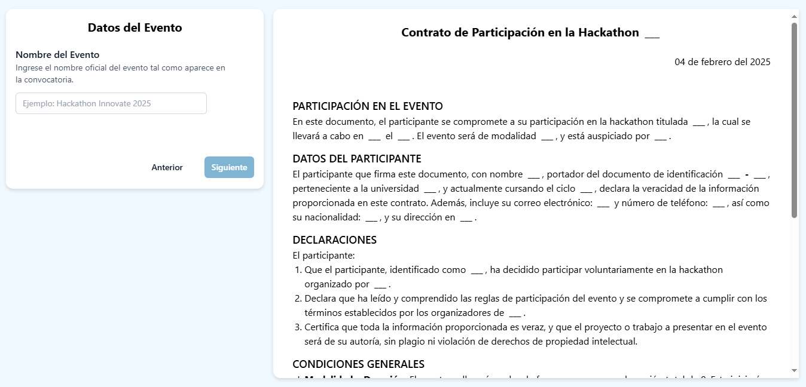

# 📄 DynamicDoc
Aplicación en Angular 19.0.7 que permite rellenar dinámicamente una plantilla de texto a medida que el usuario completa un formulario. Ideal para generar documentos predefinidos con datos personalizados en tiempo real. Utiliza `pdfMake` para generar documentos PDF con fuentes personalizadas como Poppins y Roboto.

## Características

- Generación dinámica de documentos PDF con datos ingresados por el usuario.
- Plantillas personalizables para diferentes tipos de documentos.
- Previsualización y descarga inmediata del PDF.
- Impresión directa del documento PDF.

## Requisitos

- Node.js
- Angular 19.0.7
- Tailwind 4
- pdfMake (para generación de PDFs con fuentes personalizadas)

## Captura de Pantalla
